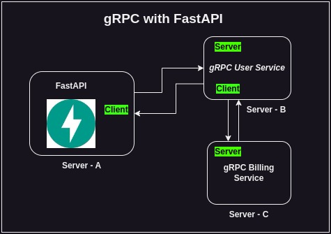

# gRPC-with-FastAPI-Python

gRPC is a remote procedure call framework developed by Google that uses HTTP/2 for transport and Protocol Buffers as the interface description language. It enables the definition and invocation of methods on the server as if they were local procedures, offering features like bi-directional streaming, strong typing, and efficient serialization.

FastAPI, on the other hand, is a modern, fast (high-performance), web framework for building APIs with Python 3.7+ based on standard Python type hints. It is designed to be easy to use, while also providing automatic validation, serialization, and documentation generation.

To connect gRPC and FastAPI, you might have a scenario where you want to expose a FastAPI web service that communicates with another service using gRPC. In such a case, you could define a FastAPI route that acts as a gateway to your gRPC service. When a request comes in through FastAPI, it could handle the request, validate input, and then make a gRPC call to another service, translating the results back to the FastAPI response.

gRPC (Remote Procedure Call) and FastAPI are two distinct technologies that serve different purposes, but they can be used together to create efficient and high-performance web services.

### As shown in Diagram

